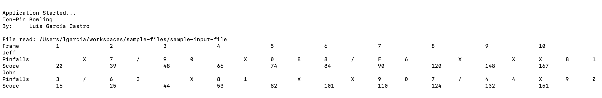
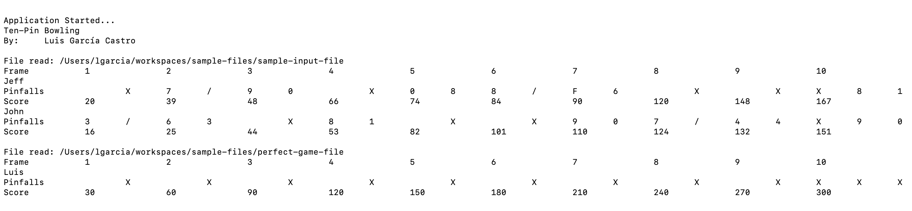

# Ten-pin Bowling

## By Luis García Castro

---

### Run Tests:

```bash
./gradlew test
```

### Clean and Build:

```bash
./gradlew clean build
```

### Execute application:

```bash
./gradlew run --args="/path/to/file/file-name"
```

With multiple files in same execution:
```bash
./gradlew run --args="/path/to/file/file-name-1 /path/to/file/file-name-2"
```

---

## Examples:

* Single-file run:

  

* Multi-file run:

  

---

## Open Project

### [IntelliJ IDEA](./docs/intellij-idea.md)

