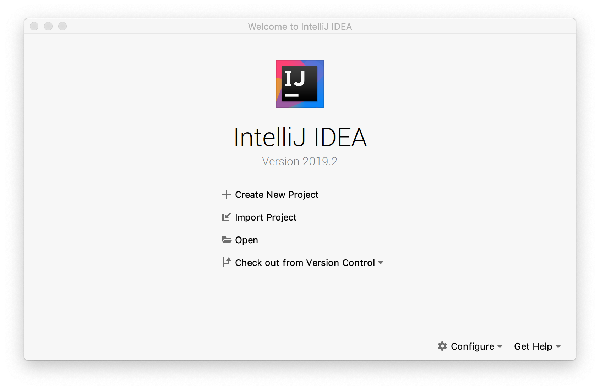
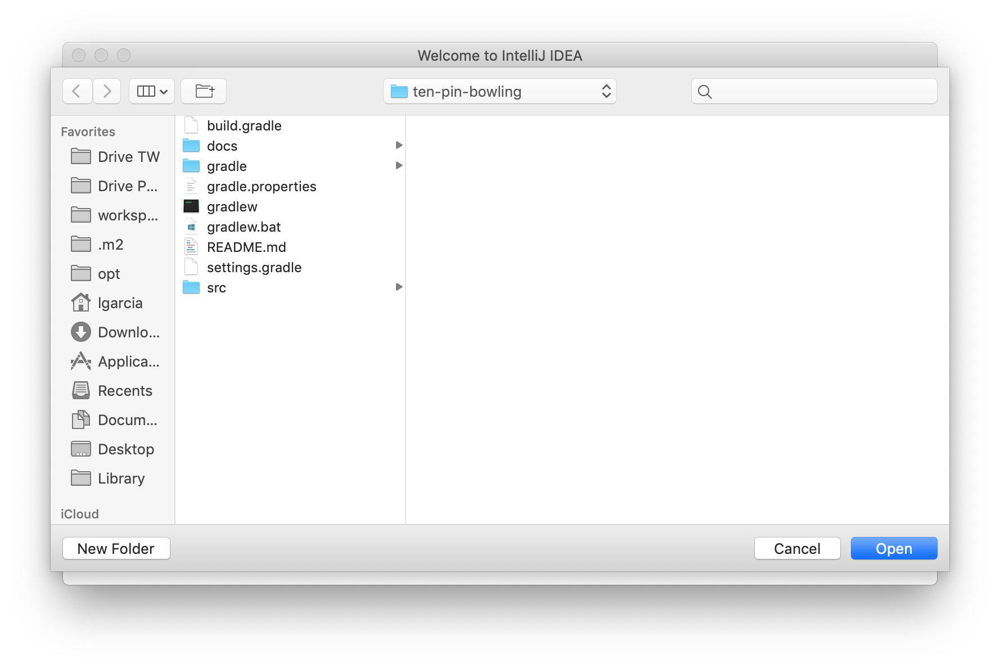
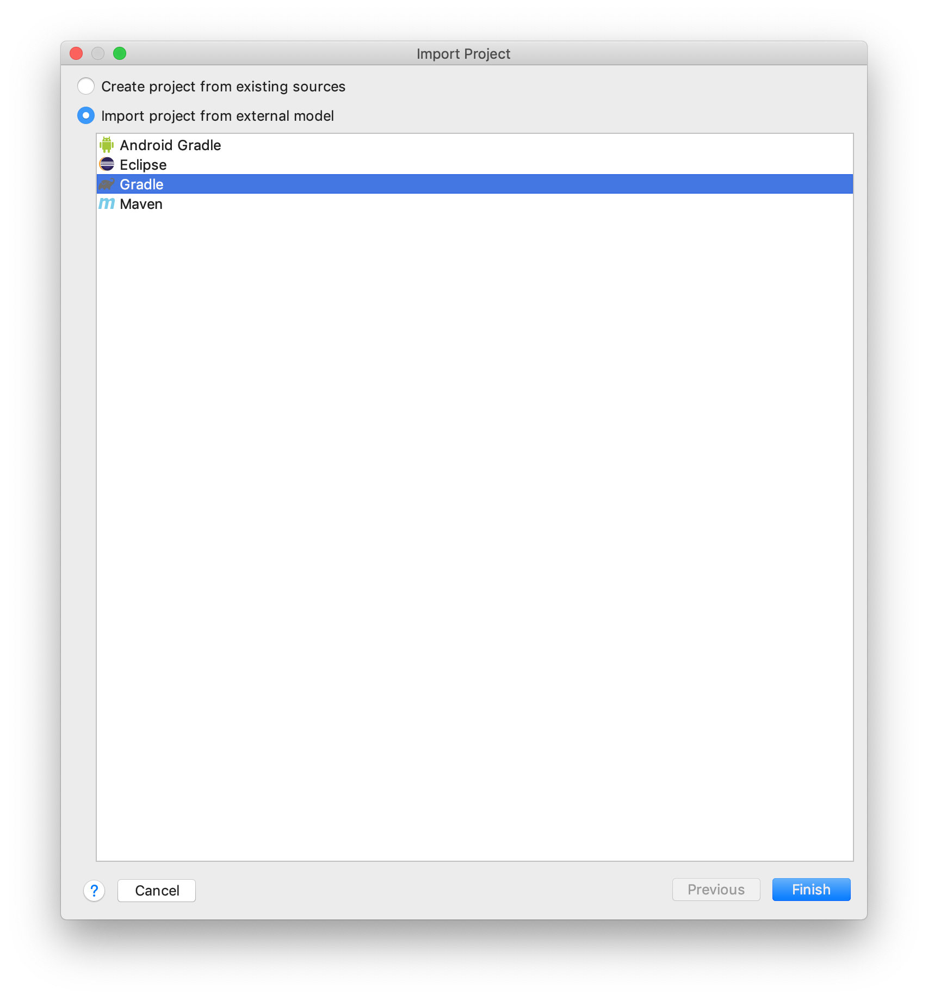
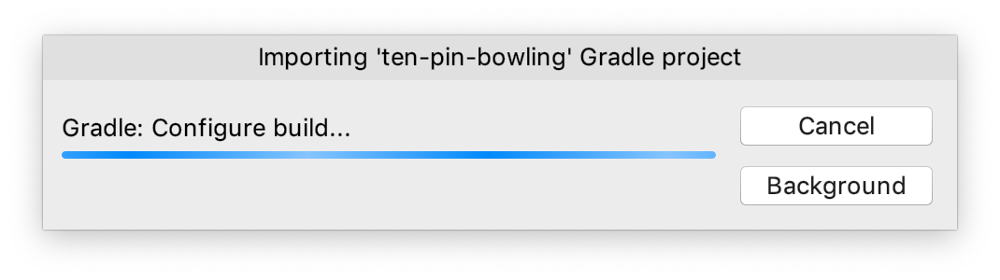
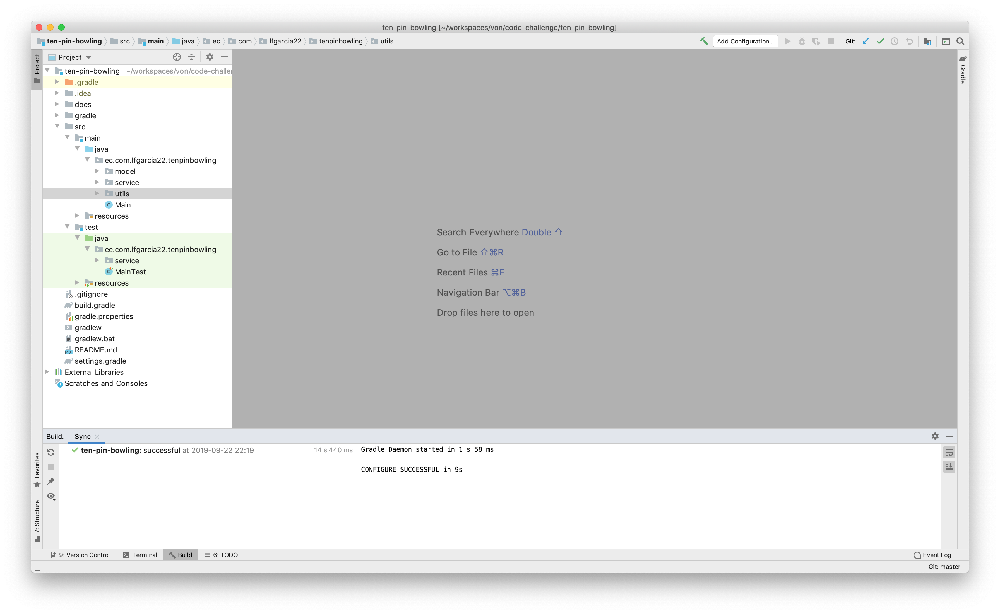

# Ten-pin Bowling

## By Luis García Castro

---

### IntelliJ IDEA

1. Open the IDE and select the options _**Import Project**_

2. Navigate to the project _**ten-pin-bowling**_ and **open** it

3. Select the option _Import project from external model_ and **pick** Gradle

4. Wait until the project is imported 

5. Start coding!

